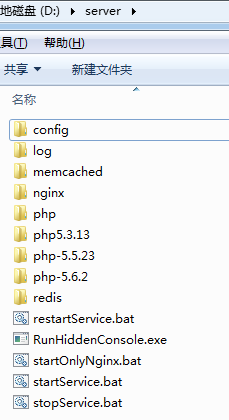

# Windows下WNMP启动相关脚本
    windows+nginx+memcache+php+redis

## 安装步骤
1. 下载windows-lnmp到电脑上；
2. 在D盘创建server文件夹；
3. 将windows-lnmp中的文件拷贝至D:\server中；
4. 在server文件夹下安装nginx、php、redis、memcache；
5. 分别配置nginx、php；

## 文件列表
- README.md 说明文件
- startService.bat 启动服务
- stopService.bat 停止服务
- restartService.bat 重启服务
- RunHiddenConsole.exe  Windows下隐藏DOS命令行窗口的程序

